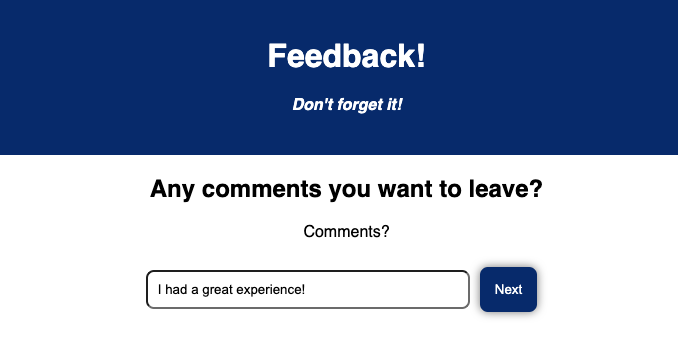
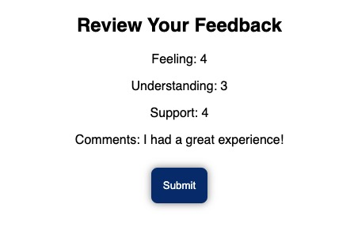

# Redux Feedback Loop

## Description:

Duration:  2 Day Sprint

The goal of this project was to create a reflection/feedback form.  Feedback is collected over 4 views/pages.  On a separate review page, the feedback values and a submit button are displayed.  Upon submitting the feedback values, the user is brought to a thank you page.  At that point, they can click on a "Leave New Feedback" button to start a new survey.

## Screen Shots:

## Prerequisites:

- axios
- express
- Node.js
- pg
- Postgress
- react
- redux

## Installation:

1. Create a database named your database name,
2. The queries in the tables.sql file are set up to create all the necessary tables and populate the needed data to allow the application to run correctly. The project is built on Postgres, so you will need to make sure to have that installed. We recommend using Postico to run those queries as that was used to create the queries,
3. Open up your editor of choice and run an npm install
4. Run npm run server in your terminal
5. Run npm run client in your terminal
6. The npm run client command will open up a new browser tab for you!

## Usage

1. Navigate to the homescreen (which starts at the "How are you feeling today?" question)
2. Enter in a numerical response (which can be done by typing or clicking on the up/down arrows)
3. Continue to navigate through the next 4 screens (filling out each input field).  Note it is currently an option to click "Next" without entering input, but this will prevent you from successfully being able to submit on the review screen.  
4.  Review your responses on the Review Your Feedback screen.  Click Submit.
5.  Close out of your browser window or click on the "Leave New Feedback" button to complete another survey.

## Built With:

- css
- react.js
- redux

## Acknowledgement:
Thank you to Prime Digital Academy - specifically to my instructor, Andrew Harasymiw and my cohort mates who helped me with troubleshooting.

## Support:
If you have suggestions or issues, please email me at stephick@gmail.com